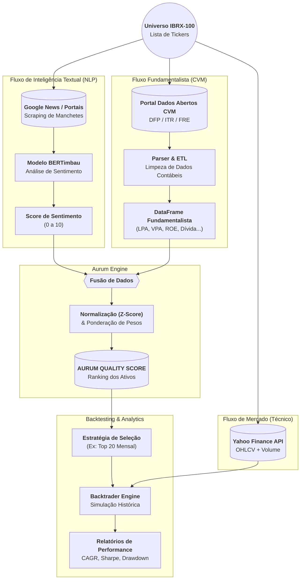

Aqui está o arquivo **README.md** completo e estruturado para o seu projeto.

Ele consolida a visão técnica, a filosofia de investimento e o roteiro de implementação baseado no seu "Prompt Mestre", incluindo o **Fluxograma Estendido** que conecta a ingestão de dados até a saída do backtest.

Você pode copiar o código abaixo e salvar como `README.md` na raiz do seu repositório.

-----

# 🦁 Laboratório Quantitativo Aurum

> **Automated Quality Factor Investing System**

O **Aurum** é um sistema quantitativo modular projetado para automatizar a análise de ações brasileiras (universo IBRX-100). O projeto combina dados fundamentalistas (Balanços/DRE) com análise de sentimento (NLP de notícias) para gerar um indicador proprietário: o **Aurum Quality Score**.

O objetivo final não é apenas a análise, mas a validação estatística através de *backtesting* robusto, comprovando a eficácia de estratégias baseadas em fatores de qualidade e sentimento.

-----

## 🧭 Filosofia e Objetivos

### A Tese (Factor Investing)

A estratégia baseia-se na premissa de que o retorno das ações pode ser explicado por fatores observáveis. O Aurum foca no fator **Qualidade (Quality)**, buscando empresas com:

1.  **Alta Rentabilidade** (ROE/ROIC elevados).
2.  **Baixa Alavancagem** (Dívida controlada).
3.  **Eficiência Operacional** (Margens estáveis).
4.  **Sentimento Positivo** (Validação via NLP de notícias recentes).

### Objetivos do Sistema

1.  **Extração de Alpha:** Identificar assimetrias de risco/retorno ignoradas pela análise manual.
2.  **Automação:** Eliminar o viés emocional humano através de um processo decisório 100% *data-driven*.
3.  **Scoring Unificado:** Sintetizar dezenas de métricas complexas em uma nota única (0-100) para cada ativo.

-----

## 🏗️ Arquitetura de Dados (Data Flow)

O fluxo de dados percorre três caminhos paralelos (Preço, Notícias, Fundamentos) que convergem para o motor de decisão.

-----

## 🛠️ Stack Tecnológico

O projeto é construído 100% em **Python**, utilizando um ecossistema robusto para Ciência de Dados e Engenharia de Software.

| Camada | Tecnologias / Bibliotecas |
| :--- | :--- |
| **Ambiente** | `Virtualenv`, `JupyterLab`, `Git` |
| **Coleta de Dados** | `yfinance` (Preço), `requests` + `BeautifulSoup4` + `newspaper3k` (Scraping), `CVM API` |
| **Processamento** | `Pandas` (Manipulação), `NumPy` (Cálculo Numérico) |
| **Banco de Dados** | `SQLAlchemy` (ORM), `SQLite` (Dev) / `PostgreSQL` (Prod) |
| **Inteligência (NLP/ML)** | `Transformers` (HuggingFace), `Scikit-learn`, `XGBoost` |
| **Backtesting** | `Backtrader` (ou `VectorBT`) |
| **Visualização** | `Matplotlib`, `Seaborn` |

-----

## 🗺️ Roadmap de Desenvolvimento

O projeto segue uma abordagem incremental dividida em 7 etapas principais:

### Fase 1: Infraestrutura e Dados

  - [ ] **1. Setup do Ambiente:** Configuração do Python e bibliotecas essenciais.
  - [ ] **2. ETL Financeiro:** Scripts para baixar e limpar dados da CVM e Yahoo Finance.
  - [ ] **3. ETL Textual:** Crawler de notícias e implementação do modelo de NLP.

### Fase 2: Core Engine

  - [ ] **4. Aurum Quality Score:** Implementação da lógica matemática (Z-Score e Pesos) para gerar o ranking.

### Fase 3: Validação e Otimização

  - [ ] **5. Motor de Backtesting:** Simulação de compra/venda histórica baseada no Score.
  - [ ] **6. Machine Learning:** Uso de modelos preditivos para refinar os pesos dos fatores.
  - [ ] **7. Reporting:** Geração automática de relatórios em PDF/HTML.

-----

## 🚀 Como Executar (Em Breve)

*Instruções de instalação, configuração do banco de dados e execução dos scripts de coleta serão adicionadas conforme o desenvolvimento avança.*

-----

*Projeto desenvolvido para fins educacionais e de pesquisa em Finanças Quantitativas.*