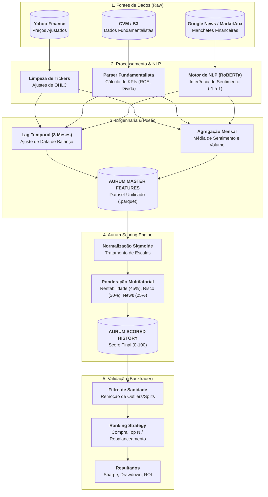

---

# 🦁 Laboratório Quantitativo Aurum

> **Automated Quality Factor Investing System**

O **Aurum** é um sistema quantitativo modular projetado para automatizar a análise de ações brasileiras (universo IBRX-100). O projeto combina dados fundamentalistas (Balanços/DRE) com análise de sentimento (NLP de notícias usando RoBERTa) para gerar um indicador proprietário: o **Aurum Quality Score**.

Diferente de screeners tradicionais, o Aurum utiliza um motor de **Scoring Multifatorial** que normaliza e pondera métricas financeiras e comportamentais, validando a tese através de simulações históricas (*backtesting*) com filtros de sanidade rigorosos.

---

## 🧭 Filosofia e Objetivos

### A Tese (Factor Investing)

A estratégia baseia-se na premissa de que o retorno das ações pode ser explicado por fatores observáveis. O Aurum foca no fator **Qualidade (Quality) Ajustada pelo Sentimento**, buscando empresas com:

1. **Alta Rentabilidade** (ROE, ROIC e Margens elevadas).
2. **Solvência Robusta** (Baixa Alavancagem e Alta Liquidez).
3. **Estabilidade** (Baixa Volatilidade de preço).
4. **Sentimento Positivo** (Validação via IA em notícias recentes).

### Objetivos do Sistema

1. **Extração de Alpha:** Identificar assimetrias de risco/retorno ignoradas pela análise manual.
2. **Automação Data-Driven:** Eliminar o viés emocional humano através de um ranking matemático (0-100).
3. **Engenharia de Dados Robusta:** Garantir integridade temporal (evitar *look-ahead bias*) no cruzamento de dados de preço e balanços.

---

## 🏗️ Arquitetura de Dados (Data Flow)

O sistema opera em um pipeline linear de 5 estágios, culminando na geração do Score Aurum e sua validação.



---

## 🛠️ Stack Tecnológico

O projeto utiliza uma stack moderna focada em performance e manipulação de grandes volumes de dados financeiros.

| Camada | Tecnologias / Bibliotecas |
| --- | --- |
| **Linguagem** | `Python 3.10+` |
| **Armazenamento** | `Parquet` (Apache Arrow) para alta performance de I/O |
| **Coleta de Dados** | `yfinance`, `GoogleNews`, `MarketAux API` |
| **Processamento** | `Pandas` (Dataframes), `NumPy` (Cálculo Vetorial) |
| **Inteligência (NLP)** | `Transformers` (HuggingFace), `RoBERTa` (Modelo de Linguagem) |
| **Backtesting** | `Backtrader` (Engine de Eventos) |
| **Visualização** | `Matplotlib` (Gráficos Financeiros) |

---

## 🗺️ Roadmap de Desenvolvimento

Status atual do desenvolvimento do projeto:

### Fase 1: Infraestrutura e Dados

* [x] **Setup do Ambiente:** Estrutura de pastas e bibliotecas.
* [x] **ETL Financeiro:** Coleta e limpeza de preços e fundamentos.
* [x] **ETL Textual:** Implementação do modelo de NLP (RoBERTa) para análise de notícias.

### Fase 2: Engenharia e Scoring

* [x] **Unificação (Merge):** Criação do dataset mestre com alinhamento temporal (Lag de balanços).
* [x] **Scoring Engine:** Implementação da classe `AurumScoringSystem` com normalização estatística e pesos dinâmicos.

### Fase 3: Validação

* [x] **Filtro de Sanidade:** Algoritmo para detectar e banir tickers com dados corrompidos (Splits/Grupamentos).
* [x] **Backtest Engine:** Simulação histórica com rebalanceamento mensal.
* [ ] **Otimização:** Refinamento de pesos via Machine Learning (Próximo Passo).
* [ ] **Paper Trading:** Execução simulada em tempo real.

---

## 🚀 Como Executar

1. **Instale as dependências:**
```bash
pip install pandas numpy backtrader yfinance torch transformers pyarrow fastparquet

```


2. **Gere o Score Aurum:**
Execute o motor de scoring para processar os dados brutos e gerar o ranking histórico.
```bash
python src/step_08_scoring_engine_final.py

```


3. **Rode o Backtest:**
Execute a simulação para verificar a performance da estratégia.
```bash
python src/step_09_backtest_final_verified.py

```


---

*Projeto desenvolvido por Kaike para fins de pesquisa em Finanças Quantitativas.*
